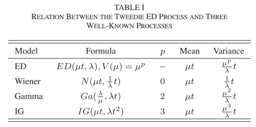

```{r setup, include=FALSE}
knitr::opts_chunk$set(warning = FALSE, message = FALSE)
```


```{r}
library(ggplot2)
library(tidyverse)
library(viridis)
library(dplyr)
```

## 6. 指数扩散 (ED) 退化过程模型

指数扩散过程 (Exponential dispersion process, EDP) 是一个广义随机过程，Wiener process (WP)、Gamma process (GP) 和 inverse Gaussian process (IGP) 都是 EDP 的特例。

<!-- EDP 有 ED 分布刻画的随机增量。  -->

**ED分布**

ED 分布是自然指数族的拓展， 通常表示为 $ED (\mu, \lambda)$， 其中参数 $\mu>0$，$\lambda>0$， PDF为
$$
p(y \mid \mu, \lambda)=c(y \mid \lambda) \cdot \exp \{\lambda[y \theta-\kappa(\theta)]\}
$$
其中 $c(\cdot)$ 是正则项，$\kappa(\cdot)$ 是满足$\mu=\kappa^{\prime}(\theta)$ 的函数。


ED分布的矩母函数：
$$
M_Y(s)=E[\exp (s \cdot Y)]=\exp \{\lambda[\kappa(\theta+s / \lambda)-\kappa(\theta)]\}
$$

由此得到$Y$的期望和方差分别为$E(Y)=\mu, Var(Y)=V(\mu) / \lambda$， 其中 $V(\mu)=\tau^{\prime}\left(\tau^{-1}(\mu)\right)=$ $\kappa^{\prime \prime}\left(\tau^{-1}(\mu)\right)$ 被称为是unit variance function。


**TED分布**

Tweedie ED (TED)模型是在对 ED 模型中具有 power unit variance function (PVF) 的一类分布，其中 PVF 分布为$V(\mu)=\mu^p$。 当$p=0,1,2,3$，TED 的形式与正态分布，Gamma分布和IG分布相同。


### 4.1 简单 ED 退化过程

#### 4.1.1 ED 过程
称ED过程 $\{Y(t), t \geq 0\}$ 是平稳 Gamma 过程, 若它满足以下性质:

  (1) $Y(0)=0$ 以概率 1 成立。

  (2) $\{Y(t), t \geq 0\}$ 具有平稳独立增量。

  (3) 增量$\{Y(t), t \geq 0\}$ 服从 ED 分布, 比如 $Y(t)-Y(s) \sim ED(\mu(t-s), \lambda), t>s>0$, 其中
    $\mathrm{ED}(\mu t, \lambda)$ 的 PDF 为
    $$
    f(y \mid \mu, \lambda, t)=c(y \mid \lambda, t) \cdot \exp \{\lambda[y \theta-t \kappa(\theta)]\} .
    $$
    
    
  因此 $Y(t)$ 的矩母函数为
    $$
    M_{Y(t)}(s)=E\{\exp [s \cdot Y(t)]\}=\exp \left\{\lambda t\left[\kappa\left(\theta+\frac{s}{\lambda}\right)-\kappa(\theta)\right]\right\}
    $$
  特征函数为
$$
\varphi_{Y(t)}(s)=M_{Y(t)}(i s)=\exp \left\{\lambda t\left[\kappa\left(\theta+\frac{i s}{\lambda}\right)-\kappa(\theta)\right]\right\}
$$

那么可以得到 $Y(t)$ 的均值和方差为$E(Y(t))=\mu t$, $Var(Y(t))=V(\mu) t / \lambda$. 定义$\sigma^2 = V(\mu) / \lambda$， 则$Y(t)$ 的方差为$\sigma^2 t$。那么参数$\mu$为漂移参数(drift parameter)，参数$\sigma$称为波动参数(volatility parameter)。


TED 过程就是当$V(\mu) = \mu^p, p \in (-\infty,0] \cup [1,+\infty)$， 此时$\sigma^2 = \mu^p / \lambda$。常用的Wiener，gamma， IG 退化过程模型对应的是$p=0,2,3$， 具体细节见下表。




#### 4.1.2 鞍点近似

因为ED分布的PDF比较复杂，且没有显式解。所以一般用鞍点近似方法去近似PDF。

**$E D(\mu t, \lambda)$ 的鞍点近似PDF：**
$$
f(y \mid \mu, \lambda, t) \cong \sqrt{\frac{\lambda}{2 \pi t V\left(\frac{y}{t}\right)}} \cdot \exp \left[-\frac{\lambda t}{2} d\left(\frac{y}{t} ; \mu\right)\right]
$$
其中
$$
d\left(\frac{y}{t} ; \mu\right)=2\left[\tilde{\theta} \frac{y}{t}-\kappa(\tilde{\theta})+\kappa(\theta)-\theta \frac{y}{t}\right]
$$
并且 $\tilde{\theta}$ 满足 $\kappa^{\prime}(\tilde{\theta})=y / t$.


**$TED(\mu t, \lambda)$ 的鞍点近似PDF：**

考虑到 TED 模型的PVF $V(\mu)=\mu^p$, 并且
$$
\kappa(\theta)= \begin{cases}\exp (\theta) & p=1 \\ -\ln (-\theta) & p=2 \\ \frac{1}{2-p}[(1-p) \theta]^{\frac{p-2}{p-1}} & p \neq 1,2\end{cases}
$$

得到TED模型的鞍点近似PDF为
$$
f(y \mid \mu, \lambda, t) \cong \sqrt{\frac{\lambda}{2 \pi t^{1-p} y^p}} \cdot \exp \left[-\frac{\lambda t}{2} d\left(\frac{y}{t} ; \mu\right)\right]
$$
其中
$$
d\left(\frac{y}{t} ; \mu\right)= \begin{cases}2\left[\frac{y}{t} \ln \left(\frac{y}{\mu t}\right)-\left(\frac{y}{t}-\mu\right)\right] & p=1 \\ 2\left[\ln \left(\frac{\mu t}{y}\right)+\frac{y}{\mu t}-1\right] & p=2 \\ 2\left[\frac{\left(\frac{y}{t}\right)^{2-p}}{(1-p)(2-p)}-\frac{\frac{y}{t} \mu^{1-p}}{1-p}+\frac{\mu^{2-p}}{2-p}\right] & p \neq 1,2 .\end{cases}
$$


#### 4.1.3 寿命分布和RUL

**ED过程的寿命分布**

根据首达时的定义，可以得到寿命时间$T$的定义如下
$$
T=\inf \left\{t>0: Y(t)>D_f \mid Y(0)<D_f\right\} .
$$

根据Hong and Ye的结论，对于退化过程 $\{Y(t), t \geq 0\} \sim ED(\mu t , \sigma)$, 寿命分布可以近似为 
$$
F_T(t) \cong \Phi\left(\frac{\mu \sqrt{t}}{\sigma}-\frac{D_f}{\sqrt{t} \sigma}\right)
$$
其中 $\Phi(\cdot)$ 是标准正态分布的CDF.


**RUL**

产品在时间点 $t_j$ 的剩余使用寿命 $R_j$ 定义为
$$
R_j=\inf \left\{r_j>0: Y\left(t_j+r_j\right)>D_f \mid Y\left(t_j\right)<D_f\right\} .
$$

$R_j$的CDF为$F_{R_j}(r_j \mid \lambda) =P(Y(t_j+r_j) D_f \mid \lambda) =P\left(Y(t_j+r_j)-Y(t_j)>D_f-Y_j \mid \lambda\right)$
根据ED过程的独立增量性，可以得到如下表达式
$$
\begin{aligned}
F_{R_j}\left(r_j \mid \lambda\right) &=P\left(Y\left(r_j\right)>D_f-Y_j \mid \lambda\right) \\
& \cong \Phi\left[\frac{\lambda^{\frac{1}{2}}}{\mu^{\frac{p}{2}}}\left(\mu \sqrt{r_j}-\frac{D_f-Y_j}{\sqrt{r_j}}\right)\right] .
\end{aligned}
$$


#### 4.1.3 数据模拟产生


#### 4.1.4 统计推断

假设共有 ${n}$ 个样品进行性能退化试验. 对于样品 $i$, 初始时刻 $t_0$ 性能退化量为 $Y_{i 0}=0$, 在时刻 $t_1, \cdots, t_{m_i}$ 测量产品的性能退化量, 得到其测量值为 $Y_{i 1}, \cdots, X_{i m_i}$. 记 $\Delta y_{i j}=Y_{i j}-Y_{i(j-1)}$ 是样品 $i$ 在时刻 $t_{j-1}$ 和 $t_j$ 之间的性能退化量, 由 Gamma 过程的独立增量性得到$\Delta y_{i j} \sim ED(\mu \Delta t_{ij},\lambda_i)$。


##### 4.1.4.1 极大似然估计


$$
\begin{aligned}
L &=\prod_{i=1}^{n} \prod_{j=1}^{m_i} f\left(\Delta y_{i j} \mid \mu, \lambda_i, \Delta t_{i j}\right) \\
&=\prod_{i=1}^{n}  \prod_{j=1}^{m_i}\left\{\sqrt{\frac{\lambda_i}{2 \pi \Delta t_{i j}^{1-p} \Delta y_{i j}^p}} \cdot \exp \left[-\frac{\lambda_i \Delta t_{i j}}{2} d\left(\frac{\Delta y_{i j}}{\Delta t_{i j}} ; \mu\right)\right]\right\}
\end{aligned}
$$
<!-- 由 ED 过程独立增量特性, 以及 -->
<!-- $$ -->
<!-- \Delta X_{i j} \sim G a\left(\alpha \Delta t_{i j}, \beta\right)=\frac{\left(\Delta x_{i j} / \beta\right)^{\alpha \Delta t_{i j}-1}}{\beta \Gamma\left(\alpha \Delta t_{i j}\right)} \mathrm{e}^{-\Delta x_{i j} / \beta} -->
<!-- $$ -->
<!-- 可以获得对数似然函数为 -->
<!-- $$ -->
<!-- l(\alpha, \beta)=\sum_{i=1}^n\left(\sum_{j=1}^{m_i}\left(\alpha \Delta t_{i j}-1\right) \ln \Delta x_{i j}-\alpha t_{i m_i} \ln \beta-\sum_{j=1}^{m_i} \ln \Gamma\left(\alpha \Delta t_{i j}\right)-\frac{x_{i m_i}}{\beta}\right) -->
<!-- $$ -->
<!-- 由极大似然估计原理, 令 -->
<!-- $$ -->
<!-- \left\{\begin{array}{l} -->
<!-- \frac{\partial l}{\partial \alpha}=\sum_{i=1}^n \sum_{j=1}^{m_i} \Delta t_{i j}\left(\ln x_{i j}-\psi\left(\alpha \Delta t_{i j}\right)-\ln \beta\right)=0 \\ -->
<!-- \frac{\partial l}{\partial \beta}=\sum_{i=1}^n\left(\frac{x_{i m_i}}{\beta^2}-\frac{\alpha t_{i m_i}}{\beta}\right)=0 -->
<!-- \end{array}\right. -->
<!-- $$ -->
<!-- 式中 $\psi(u)$ 是 digamma 函数。 -->
<!-- $$ -->
<!-- \begin{aligned} -->
<!-- &\hat{\beta}=\frac{\sum_{i=1}^n X_{i m_i}}{\alpha \sum_{i=1}^n t_{i m_i}}\\ -->
<!-- &\sum_{i=1}^n\left[\sum_{j=1}^{m_i} \Delta t_{i j} \ln \left(\Delta x_{i j}\right)-t_{i m_i} \ln \frac{x_{i m_i}}{\alpha t_{i m_i}}-\sum_{j=1}^{m_i} \Delta t_{i j} \psi\left(\alpha \Delta t_{i j}\right)\right]=0 -->
<!-- \end{aligned} -->
<!-- $$ -->


##### 4.1.2.2 贝叶斯方法


##### 4.1.2.3 广义推断方法


### 4.2 含随机效应情形

随机效应反映个体差异的不确定性，在基于 ED 过程的退化建模问题中, 随机效应通过参数$\lambda$来体现。

  - 尺度参数 $\lambda$ 是服从Gamma 分布$Ga(\alpha,\beta)$的随机变量, PDF为
$$
\pi(\lambda \mid \alpha, \beta)=\frac{\beta^\alpha}{\Gamma(\alpha)} \lambda^{\alpha-1} \exp (-\beta \lambda) .
$$
  其中 $\alpha > 0, \beta > 0$.
  
#### 4.2.1 似然函数

每个增量$\Delta y_{i j}$的PDF为
$$
\begin{aligned}
&f\left(\Delta y_{i j} \mid \mu, \lambda_i, \Delta t_{i j}\right) \\
&\quad=\sqrt{\frac{\lambda_i}{2 \pi \Delta t_{i j}^{1-p} \Delta y_{i j}^p}} \cdot \exp \left[-\frac{\lambda_i \Delta t_{i j}}{2} d\left(\frac{\Delta y_{i j}}{\Delta t_{i j}} ; \mu\right)\right]
\end{aligned}
$$
其中
$$
d\left(\frac{\Delta y_{i j}}{\Delta t_{i j}} ; \mu\right)= \begin{cases}2\left[\frac{\Delta y_{i j}}{\Delta t_{i j}} \ln \left(\frac{\Delta y_{i j}}{\mu \Delta t_{i j}}\right)-\left(\frac{\Delta y_{i j}}{\Delta t_{i j}}-\mu\right)\right] & p=1 \\ 2\left[\ln \left(\frac{\mu \Delta t_{i j}}{\Delta y_{i j}}\right)+\frac{\Delta y_{i j}}{\mu \Delta t_{i j}}-1\right] & p=2 \\ 2\left[\frac{\left(\frac{\Delta y_{i j}}{\Delta t_{i j}}\right)^{2-p}}{(1-p)(2-p)}-\frac{\frac{\Delta y_{i j}}{\Delta t_{i j}} \mu^{1-p}}{1-p}+\frac{\mu^{2-p}}{2-p}\right] & p \neq 1,2 .\end{cases}
$$


因为 $\lambda_i \sim Ga(\beta, \alpha)$, 那么对于第$i$个产品的似然函数为
$$
\begin{aligned}
L_i(\Theta)=& \int_0^{+\infty} \prod_{j=1}^{m_i} f\left(\Delta y_{i j} \mid \mu, \lambda_i, \Delta t_{i j}\right) \cdot \pi\left(\lambda_i \mid \alpha, \beta\right) d \lambda_i \\
=& \frac{\beta^\alpha}{\Gamma(\alpha)(2 \pi)^{\frac{m_i}{2}} \prod_{j=1}^{m_i}\left(\Delta t_{i j}\right)^{\frac{1-p}{2}} \prod_{j=1}^{m_i}\left(\Delta y_{i j}\right)^{\frac{p}{2}}} \\
& \cdot \frac{\Gamma\left(\frac{m_i}{2}+\alpha\right)}{\left[\beta+\frac{1}{2} \sum_{j=1}^{m_i} \Delta t_{i j} d\left(\frac{\Delta y_{i j}}{\Delta t_{i j}} ; \mu\right)\right]^{\frac{m_i}{2}+\alpha}}
\end{aligned}
$$ 
其中 $\Theta=(\mu, p, \alpha, \beta)$ 是待估模型参数向量.

因此，似然函数为
$L(\Theta)=\prod_{i=1}^n L_i(\Theta)$
$=\prod_{i=1}^n \int_0^{+\infty} \prod_{j=1}^{m_i} f\left(\Delta y_{i j} \mid \mu, \lambda_i, \Delta t_{i j}\right) \cdot \pi\left(\lambda_i \mid \alpha, \beta\right) d \lambda_i$
$=\prod_{i=1}^n\left\{\frac{\beta^\alpha}{\Gamma(\alpha)(2 \pi)^{\frac{m_i}{2}} \prod_{j=1}^{m_i}\left(\Delta t_{i j}\right)^{\frac{1-p}{2}} \prod_{j=1}^{m_i}\left(\Delta y_{i j}\right)^{\frac{p}{2}}}\right.$
$\left.\cdot \frac{\Gamma\left(\frac{m_i}{2}+\alpha\right)}{\left[\beta+\frac{1}{2} \sum_{j=1}^{m_i} \Delta t_{i j} d\left(\frac{\Delta y_{i j}}{\Delta t_{i j}} ; \mu\right)\right]^{\frac{m_i}{2}+\alpha}}\right\}$

那么，对数似然函数为
$$
\begin{aligned}
\ln L(\Theta)=& \sum_{i=1}^n\left\{\alpha \ln \beta+\ln \Gamma\left(\frac{m_i}{2}+\alpha\right)-\ln \Gamma(\alpha)-\frac{m_i}{2} \ln (2 \pi)\right.\\
&-\frac{1-p}{2} \sum_{j=1}^{m_i} \ln \left(\Delta t_{i j}\right)-\frac{p}{2} \sum_{j=1}^{m_i} \ln \left(\Delta y_{i j}\right) \\
&\left.-\left(\frac{m_i}{2}+\alpha\right) \ln \left[\beta+\frac{1}{2} \sum_{j=1}^{m_i} \Delta t_{i j} d\left(\frac{\Delta y_{i j}}{\Delta t_{i j}} ; \mu\right)\right]\right\}
\end{aligned}
$$


 
#### 4.2.2 参数估计 (EM)

因为似然函数非常复杂，所以要用EM算法去估计模型参数。

当给定 $\lambda_i$时，第 $i$ 个产品的似然函数为
$$
\begin{aligned}
&P\left(Y_{i, 0: m_i} \mid \lambda_i\right)=\prod_{j=1}^{m_i} f\left(\Delta y_{i j} \mid \mu, \lambda_i, \Delta t_{i j}\right) \\
&\quad=\prod_{j=1}^{m_i}\left\{\sqrt{\frac{\lambda_i}{2 \pi \Delta t_{i j}^{1-p} \Delta y_{i j}^p}} \cdot \exp \left[-\frac{\lambda_i \Delta t_{i j}}{2} d\left(\frac{\Delta y_{i j}}{\Delta t_{i j}} ; \mu\right)\right]\right\}
\end{aligned}
$$

基于观察值 $Y_{i, 0: m_i}$,  $\lambda_i$ 仍然服从Gamma分布：
$$
\lambda_i \mid Y_{i, 0: m_i} \sim \mathrm{Ga}\left(\beta+\frac{1}{2} \sum_{j=1}^{m_i} \Delta t_{i j} d\left(\frac{\Delta y_{i j}}{\Delta t_{i j}} ; \mu\right), \frac{m_i}{2}+\alpha\right) .
$$

那么可以得到如下式子：
$$
\begin{aligned}
E_{1 i} (\Theta) & \triangleq E\left(\lambda_i \mid Y_{i, 0: m_i}\right) \\
&= \frac{\frac{m_i}{2}+\alpha}{\beta+\frac{1}{2} \sum_{j=1}^{m_i} \Delta t_{i j} d\left(\frac{\Delta y_{i j}}{\Delta t_{i j}} ; \mu\right)}
\end{aligned}
$$


$$
\begin{aligned}
E_{2 i}(\Theta) & \triangleq E\left(\ln \lambda_i \mid Y_{i, 0: m_i}\right) \\
&=\psi\left(\frac{m_i}{2}+\alpha\right)-\ln \left[\beta+\frac{1}{2} \sum_{j=1}^{m_i} \Delta t_{i j} d\left(\frac{\Delta y_{i j}}{\Delta t_{i j}} ; \mu\right)\right]
\end{aligned}
$$
其中$\psi(\cdot)$是digamma函数.


基于观测到的退化数据和随机效应$\lambda_i$， 完整数据的似然函数为
$$
\begin{aligned}
L_C(\Theta)=& \prod_{i=1}^n\left[\prod_{j=1}^{m_i} f\left(\Delta y_{i j} \mid \mu, \lambda_i, \Delta t_{i j}\right) \cdot \pi\left(\lambda_i \mid \alpha, \beta\right)\right] \\
=& \prod_{i=1}^n \prod_{j=1}^{m_i}\left\{\sqrt{\frac{\lambda_i}{2 \pi \Delta t_{i j}^{1-p} \Delta y_{i j}^p}}\right.\\
&\left.\cdot \exp \left[-\frac{\lambda_i \Delta t_{i j}}{2} d\left(\frac{\Delta y_{i j}}{\Delta t_{i j}} ; \mu\right)\right]\right\} \\
& \cdot \prod_{i=1}^n\left[\frac{\beta^\alpha}{\Gamma(\alpha)} \lambda_i^{\alpha-1} \exp \left(-\beta \lambda_i\right)\right] .
\end{aligned}
$$

那么完整数据的对数似然函数为
$$
\begin{aligned}
\ln L_C(\Theta)=& \sum_{i=1}^n \sum_{j=1}^{m_i}\left[\frac{1}{2} \ln \lambda_i-\frac{1}{2} \ln (2 \pi)-\frac{p}{2} \ln \left(\Delta y_{i j}\right)\right.\\
&\left.-\frac{1-p}{2} \ln \left(\Delta t_{i j}\right)-\frac{\lambda_i \Delta t_{i j}}{2} d\left(\frac{\Delta y_{i j}}{\Delta t_{i j}} ; \mu\right)\right] \\
&+\sum_{i=1}^n\left[\alpha \ln \beta-\ln \Gamma(\alpha)+(\alpha-1) \ln \lambda_i-\beta \lambda_i\right] .
\end{aligned}
$$

根据以上内容，可以得到EM算法如下：
<!-- In the following, the EM algorithm is used to compute the estimator of the model parameter vector $\Theta=(\mu, p, \alpha, \beta)$. -->

**E-step**: 计算 $Q = E(\ln L_C(\Theta) \mid Y_{1: n, 0: m_i})$. 假设当值的模型参数为$\Theta^{(l)}=$ $\left(\mu^{(l)}, p^{(l)}, \alpha^{(l)}, \beta^{(l)}\right)$, 那么 $Q$ 可以表达为
$$
\begin{aligned}
Q\left(\Theta \mid \Theta^{(l)}\right) &=E\left(\ln L_C(\Theta) \mid Y_{1: n, 0: m_i}, \Theta^{(l)}\right) \\
&=\sum_{i=1}^n \sum_{j=1}^{m_i}\left[\frac{1}{2} E_{2 i}\left(\Theta^{(l)}\right)-\frac{1}{2} \ln (2 \pi)-\frac{p}{2} \ln \left(\Delta y_{i j}\right)\right.\\
&\left.-\frac{1-p}{2} \ln \left(\Delta t_{i j}\right)-\frac{E_{1 i}\left(\Theta^{(l)}\right) \Delta t_{i j}}{2} d\left(\frac{\Delta y_{i j}}{\Delta t_{i j}} ; \mu\right)\right] \\
&+\sum_{i=1}^n\left[\alpha \ln \beta-\ln \Gamma(\alpha)+(\alpha-1) E_{2 i}\left(\Theta^{(l)}\right)\right.\\
&\left.-\beta E_{1 i}\left(\Theta^{(l)}\right)\right] .
\end{aligned}
$$


**M-step**: 计算$Q\left(\Theta \mid \Theta^{(l)}\right)$对$\Theta$的一阶导, 那么下一步$\Theta^{(l+1)}$可以根据如下式子求解:
$$
\left\{\begin{array}{l}
\frac{\partial Q}{\partial \mu}=\mu^{-p} \sum_{i=1}^n \sum_{j=1}^{m_i}\left[E_{1 i}\left(\Theta^{(l)}\right) \Delta y_{i j}\right. \\
\left.\quad-\mu E_{1 i}\left(\Theta^{(l)}\right) \Delta t_{i j}\right]=0 \\
\frac{\partial Q}{\partial p}=\frac{1}{2} \sum_{i=1}^n \sum_{j=1}^{m_i}\left[\ln \left(\frac{\Delta t_{i j}}{\Delta y_{i j}}\right)-E_{1 i}\left(\Theta^{(l)}\right) \Delta t_{i j} \frac{\partial d}{\partial p}\right]=0 \\
\frac{\partial Q}{\partial \alpha}=\sum_{i=1}^n\left[\ln \beta-\psi(\alpha)+E_{2 i}\left(\Theta^{(l)}\right)\right]=0 \\
\frac{\partial Q}{\partial \beta}=\sum_{i=1}^n\left[\frac{\alpha}{\beta}-E_{1 i}\left(\Theta^{(l)}\right)\right]=0
\end{array}\right.
$$
其中 
$$
\frac{\partial d}{\partial p}=2\left[\frac{(p-1)(2-p)\left(\frac{\Delta y_{i j}}{\Delta t_{i j}}\right)^{2-p} \ln \left(\frac{\Delta y_{i j}}{\Delta i_{i j}}\right)-(2 p-3)\left(\frac{\Delta y_{i j}}{\Delta i_{i j}}\right)^{2-p}}{(1-p)^2(2-p)^2}-\right. \left.\frac{(p-1) \frac{\Delta y_{i j}}{\Delta t_{i j}} \mu^{1-p} \ln \mu+\frac{\Delta y_{i j}}{\Delta t_{i j}} \mu^{1-p}}{(1-p)^2}+\frac{(p-2) \mu^{2-p} \ln \mu+\mu^{2-p}}{(2-p)^2}\right], p \neq 1,2
$$.
To be specific, $\Theta^{(l+1)}=\left(\mu^{(l+1)}, p^{(l+1)}, \alpha^{(l+1)}, \beta^{(l+1)}\right)$ can be obtained by the following steps.


To be specific, $\Theta^{(l+1)}=\left(\mu^{(l+1)}, p^{(l+1)}, \alpha^{(l+1)}, \beta^{(l+1)}\right)$ can be obtained by the following steps.

Step 1: Solve the first equation of (17) to get
$$
\mu^{(l+1)}=\frac{\sum_{i=1}^n \sum_{j=1}^{m_i}\left[E_{1 i}\left(\Theta^{(l)}\right) \Delta y_{i j}\right]}{\sum_{i=1}^n \sum_{j=1}^{m_i}\left[E_{1 i}\left(\Theta^{(l)}\right) \Delta t_{i j}\right]} .
$$

Step 2: Put $\mu^{(l+1)}$ into the second equation to obtain $p^{(l+1)}$.

Step 3: Eliminating $\beta$ from the last two equations, one gets the equation of $\alpha$ as
$$
\begin{aligned}
&\sum_{i=1}^n\left[\ln (n)+\ln \alpha-\ln \left(\sum_{i=1}^n E_{1 i}\left(\Theta^{(l)}\right)\right)-\psi(\alpha)\right. \\
&\left.+E_{2 i}\left(\Theta^{(l)}\right)\right]=0
\end{aligned}
$$
from which $\alpha^{(l+1)}$ is derived.

Step 4: Put $\alpha^{(l+1)}$ into the last equation, one has
$$
\beta^{(l+1)}=\frac{n \alpha^{(l+1)}}{\sum_{i=1}^n E_{1 i}\left(\Theta^{(l)}\right)} .
$$
When $p=1,2$, the model parameter vector $\Theta$ is reduced to $(\mu, \alpha, \beta)$, which can also be estimated by the above EM algorithm.


#### 4.2.3 可靠度


In the ED model with random effect, $\sigma=\mu^{\frac{p}{2}} / \lambda^{\frac{1}{2}}$, and $\lambda \sim \mathrm{Ga}(\beta, \alpha)$. Given $\lambda$, the CDF of the FHT of the proposed degradation model can be presented as
$$
F_T(t \mid \lambda) \cong \Phi\left[\frac{\lambda^{\frac{1}{2}}}{\mu^{\frac{p}{2}}}\left(\mu \sqrt{t}-\frac{D_f}{\sqrt{t}}\right)\right] .
$$


Therefore, the PDF of the lifetime distribution of the product for given $\lambda$ is
$$
f_T(t \mid \lambda) \cong \frac{\lambda^{\frac{1}{2}}\left(\mu+\frac{D_f}{t}\right)}{2 \sqrt{t} \mu^{\frac{p}{2}}} \phi\left[\frac{\lambda^{\frac{1}{2}}}{\mu^{\frac{p}{2}}}\left(\mu \sqrt{t}-\frac{D_f}{\sqrt{t}}\right)\right]
$$
where $\phi(\cdot)$ is the PDF of the standard normal distribution. Taking


Taking the random effect $\lambda$ into account, the CDF and PDF of the lifetime distribution of the product can be obtained based on $(20)$ and (21), respectively.
$$
\begin{aligned}
F_T(t) &=\int_0^{+\infty} F_T(t \mid \lambda) \cdot \pi(\lambda \mid \alpha, \beta) d \lambda \\
& \cong \int_0^{+\infty} \Phi\left[\frac{\lambda^{\frac{1}{2}}}{\mu^{\frac{2}{2}}}\left(\mu \sqrt{t}-\frac{D_f}{\sqrt{t}}\right)\right] \cdot \frac{\beta^\alpha}{\Gamma(\alpha)} \lambda^{\alpha-1} \exp (-\beta \lambda) d \lambda
\end{aligned}
$$
$$
\begin{aligned}
f_T(t) &=\int_0^{\infty} f_T(t \mid \lambda) \cdot \pi(\lambda \mid \alpha, \beta) d \lambda \\
& \cong \frac{\beta^\alpha \Gamma\left(\alpha+\frac{1}{2}\right)\left(\mu+\frac{D_f}{t}\right)}{2 \sqrt{2 \pi t} \Gamma(\alpha) \mu^{\frac{p}{2}}\left[\beta+\frac{\left(D_f-\mu t\right)^2}{2 \mu^p t}\right]^{\alpha+\frac{1}{2}}}
\end{aligned}
$$


Furthermore, suppose that the product is discretely monitored at time points $0=t_0<t_1<\cdots<t_j$, and the degradation observation at time point $t_j$ is denoted as $Y\left(t_j\right)=Y_j$, then the $\mathrm{CDF}$ and PDF of the RUL distribution of the product at time point $t_j$ can also be obtained. In a similar way, the concept of $\mathrm{FHT}$ is used to define the RUL $R_j$ of the product at time point $t_j$. The RUL $R_j$ is defined as
$$
R_j=\inf \left\{r_j>0: Y\left(t_j+r_j\right)>D_f \mid Y\left(t_j\right)<D_f\right\} .
$$

For given $\lambda$, the CDF of $R_j$ is $F_{R_j}\left(r_j \mid \lambda\right)=P\left(Y\left(t_j+r_j\right)>\right.$ $\left.D_f \mid \lambda\right)=P\left(Y\left(t_j+r_j\right)-Y\left(t_j\right)>D_f-Y_j \mid \lambda\right)$. Due to the stationary increment property of the discussed ED process, one has
$$
\begin{aligned}
F_{R_j}\left(r_j \mid \lambda\right) &=P\left(Y\left(r_j\right)>D_f-Y_j \mid \lambda\right) \\
& \cong \Phi\left[\frac{\lambda^{\frac{1}{2}}}{\mu^{\frac{p}{2}}}\left(\mu \sqrt{r_j}-\frac{D_f-Y_j}{\sqrt{r_j}}\right)\right] .
\end{aligned}
$$

Considering the random effect $\lambda$, the CDF and PDF of the RUL $R_j$ of the product can be derived as
$$
\begin{aligned}
F_{R_j}\left(r_j\right) \cong & \int_0^{+\infty} \Phi\left[\frac{\lambda^{\frac{1}{2}}}{\mu^{\frac{p}{2}}}\left(\mu \sqrt{r_j}-\frac{D_f-Y_j}{\sqrt{r_j}}\right)\right] \\
& \cdot \frac{\beta^\alpha}{\Gamma(\alpha)} \lambda^{\alpha-1} \exp (-\beta \lambda) d \lambda \\
f_{R_j}\left(r_j\right) \cong & \frac{\beta^\alpha \Gamma\left(\alpha+\frac{1}{2}\right)\left(\mu+\frac{D_f-Y_j}{r_j}\right)}{2 \sqrt{2 \pi r_j} \Gamma(\alpha) \mu^{\frac{p}{2}}\left[\beta+\frac{\left(D_f-Y_j-\mu r_j\right)^2}{2 \mu^p r_j}\right]^{\alpha+\frac{1}{2}}}
\end{aligned}
$$


### 4.3 有随机效应和协变量情形

In this part, we consider the ED process with both random effects and covariates. Assume there are $J$ stress levels $S_{1}<$ $S_{2}<\cdots<S_{J}$, and $S_{1} \geq S_{0}, S_{J} \leq S_{H}$, where $S_{0}$ is the normal usage stress level and $S_{H}$ is an upper bound of the stress level. The $k$ th normalized stress level is defined as
	$$
	x_{k}=\frac{X\left(S_{k}\right)-X\left(S_{0}\right)}{X\left(S_{H}\right)-X\left(S_{0}\right)}
	$$
where $X\left(S_{k}\right)$ is a suitable function of stress level $S_{k}$. After normalization, the standard stress levels satisfy $0=x_{0} \leq x_{1}<x_{2}<\cdots<x_{J} \leq x_{H}=1$.

**the random effect**: $\lambda$ by setting $\lambda \sim \mathrm{Ga}(\beta, \alpha)$. 
	
**covariate**: $\mu$ as $\mu_{k}=$ $\mu_{0} \exp \left(q \cdot x_{k}\right)$, where $\mu_{0}$ is the drift parameter at the normal use stress level $S_{0}, q>0$ is a parameter


#### 4.3.1 似然函数

Suppose that $n$ test units are available for conducting an ADT with $J$ stress levels, and $n_{k}$ units tested under stress level $S_{k}, k=1,2, \ldots, J$, with $\sum_{k=1}^{J} n_{k}=n$. Let $Y\left(t_{k, i, j}\right)=Y_{k, i, j}$ denote degradation observation of the $i$ th unit at the $j$ th test under the $k$ th stress level at time point $t_{k, i, j}$ with $t_{k, i, 0}=$ 0 , for $k=1,2, \ldots, J ; i=1,2, \ldots, n_{k} ; j=0,1,2, \ldots, m_{k i}$. The degradation increment $\Delta y_{k i j}=Y\left(t_{k, i, j}\right)-Y\left(t_{k, i, j-1}\right) \sim$ $\operatorname{ED}\left(\mu_{k} \Delta t_{k i j}, \lambda_{k i}\right)$ for given $\lambda_{k i}$, where $\Delta t_{k i j}=t_{k, i, j}-$ $t_{k, i, j-1}$, and $\lambda_{k i}$ follows gamma distribution as $\lambda_{k i} \sim \mathrm{Ga}(\beta, \alpha)$.
	
		
Denote the model parameter vector as $\Theta=\left(\mu_{0}, q, p, \alpha, \beta\right)$, the log-likelihood function is
	$$
	\begin{gathered}
		\ln L(\Theta)=\sum_{k=1}^{J} \sum_{i=1}^{n_{k}}\left\{\alpha \ln \beta+\ln \Gamma\left(\frac{m_{k i}}{2}+\alpha\right)-\frac{m_{k i}}{2} \ln (2 \pi)\right. \\
		-\ln \Gamma(\alpha)-\frac{1-p}{2} \sum_{j=1}^{m_{k i}} \ln \left(\Delta t_{k i j}\right)-\frac{p}{2} \sum_{j=1}^{m_{k i}} \ln \left(\Delta y_{k i j}\right) \\
		\left.-\left(\frac{m_{k i}}{2}+\alpha\right) \ln \left[\beta+\frac{1}{2} \sum_{j=1}^{m_{k i}} \Delta t_{k i j} d\left(\frac{\Delta y_{k i j}}{\Delta t_{k i j}} ; \mu_{k}\right)\right]\right\}
	\end{gathered}
	$$


where 

$$	
d\left(\frac{\Delta y_{k i j}}{\Delta t_{k i j}} ; \mu_{k}\right)= \begin{cases}2\left[\frac{\Delta y_{k i j}}{\Delta t_{k i j}} \ln \left(\frac{\Delta y_{k i j}}{\mu_{k} \Delta t_{k i j}}\right)-\left(\frac{\Delta y_{k i j}}{\Delta t_{k i j}}-\mu_{k}\right)\right] & p=1 \\ \\ 2\left[\ln \left(\frac{\mu_{k} \Delta t_{k i j}}{\Delta y_{k i j}}\right)+\frac{\Delta y_{k i j}}{\mu_{k} \Delta t_{k i j}}-1\right] & p=2 \\ \\ 2\left[\frac{\left(\frac{\Delta y_{k i j}}{\Delta t_{k i j}}\right)^{2-p}}{(1-p)(2-p)}-\frac{\frac{\Delta y_{k i j}}{\Delta t_{k i j}} \mu_{k}^{1-p}}{1-p}+\frac{\mu_{k}^{2-p}}{2-p}\right] & p \neq 1,2 .\end{cases}
$$	

#### 4.3.2 参数估计


Given the degradation data $Y_{1: J, 1: n_{k}, 0: m_{k i}}$, and the random effects $\lambda_{k i}$, the complete-data log-likelihood function can be expressed as
$$
	\begin{aligned}
		\ln L_{C}(\Theta)&=\sum_{k=1}^{J} \sum_{i=1}^{n_{k}} \sum_{j=1}^{m_{k i}}\left[\frac{1}{2} \ln \lambda_{k i}-\frac{1}{2} \ln (2 \pi)-\frac{p}{2} \ln \left(\Delta y_{k i j}\right)\right.\\
		&\left.-\frac{1-p}{2} \ln \left(\Delta t_{k i j}\right)-\frac{\lambda_{k i} \Delta t_{k i j}}{2} d\left(\frac{\Delta y_{k i j}}{\Delta t_{k i j}} ; \mu_{k}\right)\right] \\
		&+ \sum_{k=1}^{J} \sum_{i=1}^{n_{k}}\left[\alpha \ln \beta-\ln \Gamma(\alpha)+(\alpha-1) \ln \lambda_{k i}-\beta \lambda_{k i}\right]
	\end{aligned}
$$
	
	
**E-step:**
	
Calculate the $Q$-function, which is the expectation of $\ln L_{C}(\Theta)$ conditional on $Y_{1: J, 1: n_{k}, 0: m_{k i}}$.
%	 Assume that the current value of the model parameter vector is $\Theta^{(l)}=$ $\left(\mu_{0}^{(l)}, q^{(l)}, p^{(l)}, \alpha^{(l)}, \beta^{(l)}\right)$, then the $Q$-function is
$$
\begin{aligned}
	Q&\left(\Theta \mid \Theta^{(l)}\right)=E\left(\ln L_{C}(\Theta) \mid Y_{1: J, 1: n_{k}, 0: m_{k i}}, \Theta^{(l)}\right) \\
	&= \sum_{k=1}^{J} \sum_{i=1}^{n_{k}} \sum_{j=1}^{m_{k i}}\left[\frac{1}{2} E_{2 k i}\left(\Theta^{(l)}\right)-\frac{1}{2} \ln (2 \pi)-\frac{p}{2} \ln \left(\Delta y_{k i j}\right)\right.\\
	&\left.-\frac{1-p}{2} \ln \left(\Delta t_{k i j}\right)-\frac{E_{1 k i}\left(\Theta^{(l)}\right) \Delta t_{k i j}}{2} d\left(\frac{\Delta y_{k i j}}{\Delta t_{k i j}} ; \mu_{k}\right)\right] \\
	&+\sum_{k=1}^{J} \sum_{i=1}^{n_{k}}\left[\alpha \ln \beta-\ln \Gamma(\alpha)+(\alpha-1) E_{2 k i}\left(\Theta^{(l)}\right)-\beta E_{1 k i}\left(\Theta^{(l)}\right)\right]
\end{aligned}
$$

	
where
$$
	\begin{aligned}
		&E_{1 k i}(\Theta) \triangleq E\left(\lambda_{k i} \mid Y_{k, i, 0: m_{k i}}\right) 
		=\frac{\frac{m_{k i}}{2}+\alpha}{\beta+\frac{1}{2} \sum_{j=1}^{m_{k i}} \Delta t_{k i j} d\left(\frac{\Delta y_{k i j}}{\Delta t_{k i j}} ; \mu_{k}\right)} \\
		&E_{2 k i}(\Theta) \triangleq E\left(\ln \lambda_{k i} \mid Y_{k, i, 0: m_{k i}}\right)\\
		&=\psi\left(\frac{m_{k i}}{2}+\alpha\right)-\ln \left[\beta+\frac{1}{2} \sum_{j=1}^{m_{k i}} \Delta t_{k i j} d\left(\frac{\Delta y_{k i j}}{\Delta t_{k i j}} ; \mu_{k}\right)\right] .
	\end{aligned}
$$	

**M-step**:

Obtain $\Theta^{(l+1)}$ by maximizing $Q\left(\Theta \mid \Theta^{(l)}\right)$. That is, $\Theta^{(l+1)}=\arg \max _{\Theta}\left\{Q\left(\Theta \mid \Theta^{(l)}\right)\right\}$
	


#### 4.3.3


### 4.4 案例分析

GaAs Laser (Wiener数据集中有)

